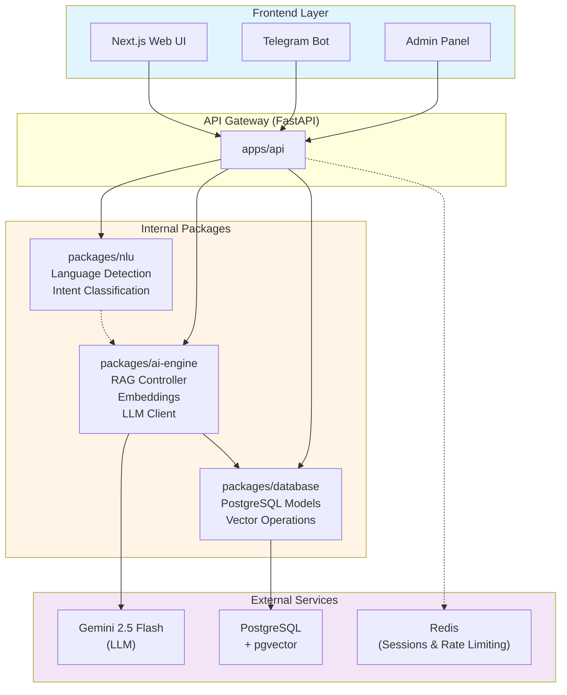
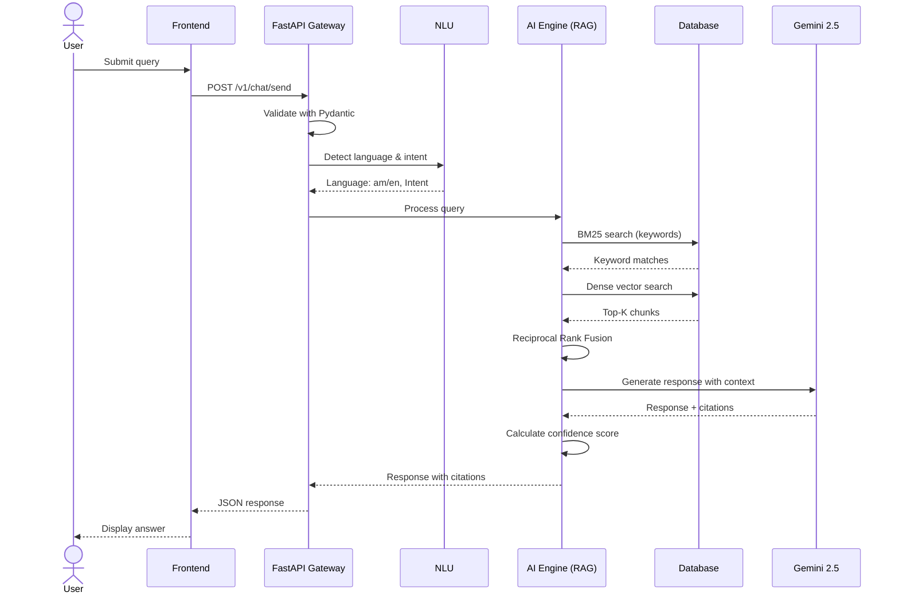
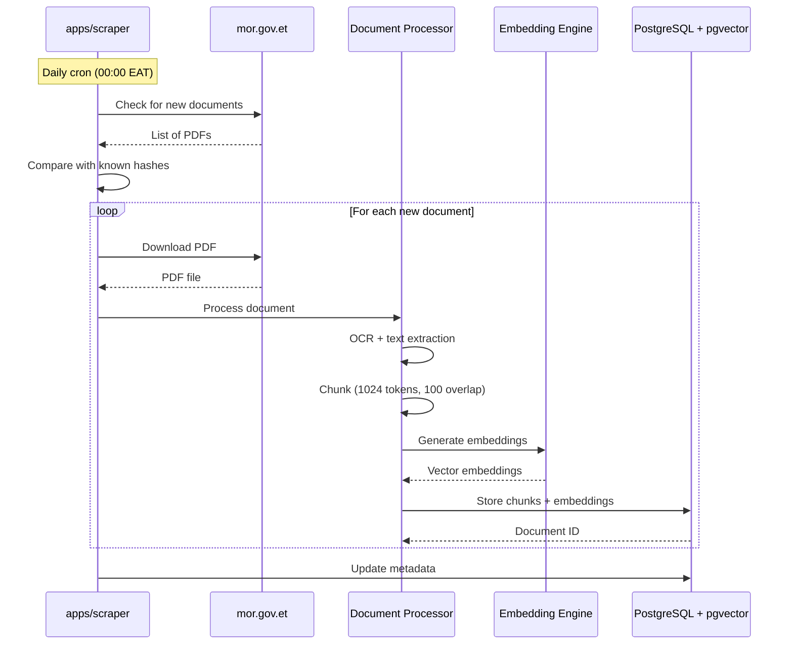

# Awaqi System Architecture

## Overview
Awaqi is an AI-powered Support Bot for the Ethiopian Revenue Authority, designed to enhance information desk services for taxpayers and business owners. The system uses Retrieval Augmented Generation (RAG) to provide accurate, cited responses based on official regulatory documents.

## Technology Stack

### Frontend
- **Framework**: Next.js 15 (React with TypeScript)
- **UI Library**: shadcn/ui (Radix UI components)
- **Internationalization**: next-intl (Amharic and English support)
- **Styling**: Tailwind CSS

### Backend
- **API Framework**: FastAPI (Python 3.12+)
- **Package Manager**: uv (Universal Python Project Manager)
- **LLM**: Gemini 2.5 Flash
- **Embeddings**: multilingual-e5-large (planned)
- **Vector Database**: PostgreSQL + pgvector (planned)
- **NLU**: XLM-RoBERTa, fastText (planned)

### Infrastructure
- **Containerization**: Docker
- **Session Storage**: Redis (planned)
- **Rate Limiting**: Redis-based (planned)

## Monorepo Structure

```
/
├── apps/                      # Standalone applications
│   ├── api/                   # FastAPI backend gateway
│   ├── web/                   # Next.js frontend
│   ├── telegram-bot/          # Telegram service
│   └── scraper/               # MoR website scraper
├── packages/                  # Shared internal libraries
│   ├── ai-engine/             # RAG, LLM, embeddings
│   ├── database/              # PostgreSQL models & schemas
│   ├── nlu/                   # Language detection, intent classification
│   └── utils/                 # Shared utilities
└── docker/                    # Docker configurations
```

### Apps

#### 1. `apps/api` - Web Backend Gateway
**Purpose**: Main HTTP API for the frontend and Telegram bot.

**Key Features**:
- RESTful endpoints for chat, auth, and admin operations
- CORS configuration for frontend integration
- Session management
- Rate limiting (planned)

**Current Endpoints**:
- `GET /health`: Health check
- `POST /v1/chat/send`: Send a message to the chatbot
- `GET /v1/chat/history/{session_id}`: Retrieve conversation history
- `POST /v1/chat/feedback/{message_id}`: Submit feedback
- `POST /v1/auth/login`: Admin authentication
- `POST /v1/admin/upload`: Upload regulatory documents
- `GET /v1/admin/logs`: View system logs
- `POST /v1/admin/scrape`: Trigger scraper job

**Dependencies**:
- `fastapi`, `pydantic`, `uvicorn`
- Internal: `ai-engine`, `database`, `nlu`

#### 2. `apps/web` - Next.js Frontend
**Purpose**: User-facing web interface for the chatbot.

**Key Routes**:
- `/[locale]/`: Landing page
- `/[locale]/chat`: Main chat interface
- `/[locale]/login`: Admin login
- `/[locale]/chat/settings`: User settings (planned)

**Features**:
- Bilingual support (Amharic/English)
- Dark mode UI
- Responsive design
- Session-based chat history

#### 3. `apps/scraper` - Automated Knowledge Ingestor
**Purpose**: Scrape regulatory documents from mor.gov.et.

**Planned Features**:
- Daily cron job (00:00 EAT)
- PDF download and processing
- Document change detection
- Integration with `database` package

#### 4. `apps/telegram-bot` - Telegram Service
**Purpose**: Telegram interface for the chatbot (@ERATaxBot).

**Planned Features**:
- Telegram Bot API integration
- Same backend logic as web interface
- Multi-turn conversation support

### Packages

#### 1. `packages/ai-engine` - The "Brains"
**Purpose**: Core RAG logic, LLM interaction, and embedding generation.

**Planned Components**:
- `EmbeddingEngine`: Text-to-vector conversion
- `VectorStoreClient`: Interface to pgvector
- `LLMClient`: Gemini API wrapper
- `RAGController`: Hybrid retrieval + generation logic

**Algorithms**:
- BM25 (sparse retrieval)
- Dense vector search (cosine similarity)
- Reciprocal Rank Fusion (RRF)
- Confidence scoring

#### 2. `packages/database` - Data Layer
**Purpose**: PostgreSQL schemas, vector operations, and ORM.

**Planned Models**:
- `Document`: Regulatory documents
- `User`: Admin users
- `ChatSession`: Conversation history
- `Message`: Individual messages

**Features**:
- pgvector extension for embeddings
- Full-text search support

#### 3. `packages/nlu` - Natural Language Understanding
**Purpose**: Language detection and intent classification.

**Planned Components**:
- Language detection (fastText)
- Intent classification (XLM-RoBERTa)
- Entity extraction (Gemini-based)

#### 4. `packages/utils` - Shared Utilities
**Purpose**: Common helper functions and constants.

## System Architecture Diagram



## Data Flow

### 1. User Query Flow



**Steps**:
1. User submits query via web/Telegram → `POST /v1/chat/send`
2. API validates request using Pydantic models
3. NLU detects language and classifies intent
4. AI Engine retrieves relevant document chunks (BM25 + dense search)
5. LLM generates response with citations
6. Response returned to frontend with confidence score

### 2. Document Ingestion Flow



**Steps**:
1. Scraper downloads PDFs from mor.gov.et
2. Documents are processed (OCR, chunking)
3. Embeddings are generated for each chunk
4. Chunks and embeddings stored in PostgreSQL (pgvector)

## Development Workflow

### Adding Dependencies
```bash
# Add external library to a specific package
uv add --package ai-engine langchain

# Add internal workspace dependency
uv add --package api ai-engine

# Sync all dependencies
uv sync
```

### Running Services
```bash
# Frontend
cd apps/web && npm run dev

# Backend
uv run --package api uvicorn apps.api.main:app --reload --port 8000

# View API docs
http://localhost:8000/docs
```

## Security

### Access Control
- **Public Users**: Anonymous session-based authentication (read-only chat)
- **Admins**: JWT-based authentication with CRUD privileges

### Rate Limiting
- 15 requests per 10 minutes per IP (planned)
- Redis-backed with automatic expiry

### Data Privacy
- Guest session data stored in volatile Redis (10-minute TTL)
- No PII collection from public users

## Future Enhancements
1. Implement actual RAG logic in `ai-engine`
2. Connect `database` package with PostgreSQL
3. Implement scraper automation
4. Add multi-turn conversation context
5. Implement confidence-based fallback ("Contact ERA officer")
6. Add Telegram bot deployment
7. Implement RBAC for admin panel

## References
- Design Spec: `G13 SDS Support Bot AI.docx.md`
- Requirements: `G13 SRS Suport Bot AI.docx.md`
- API Documentation: `http://localhost:8000/docs` (when running)
